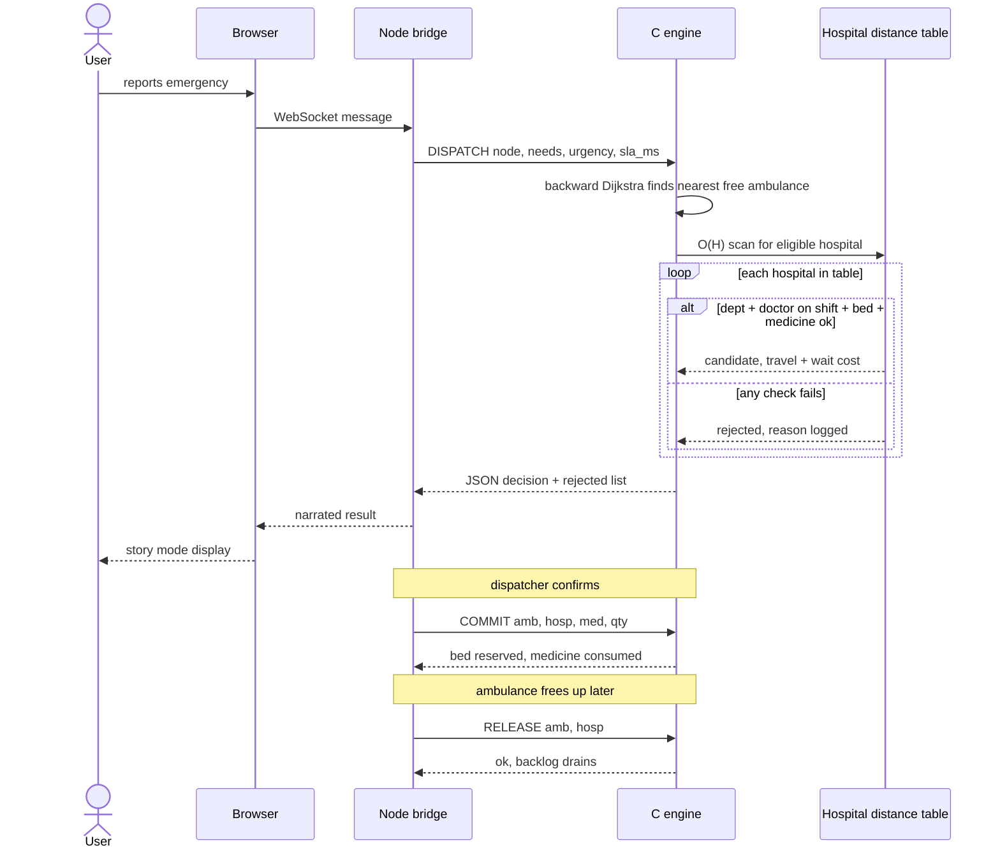

# HealthWay

**A rural healthcare dispatch engine** — matching ambulances and hospitals to
emergencies in real time, written from scratch in C, with a live web
simulation on top.

> Most systems answer *"which hospital is nearest?"* HealthWay answers the
> question that actually matters in an emergency: *which hospital can
> actually treat this patient fastest*, accounting for whether it has the
> right specialist on shift, a free bed, and the medicine in stock.

---

## TL;DR for judges

| | |
|---|---|
| **What it is** | A dispatch algorithm + simulated city of 50,000 road nodes, 60 hospitals, 420 doctors on rotating shifts, and 200 ambulances |
| **Core result** | Picks the provably optimal hospital in **~51 microseconds**, 26× faster than an exhaustive correct search, with **zero wrong answers** across 20,000+ test requests |
| **Why it's hard** | The nearest hospital is often the *wrong* one — no specialist on duty, no bed, or out of medicine — so the engine must reason about capacity, not just distance |
| **See it live** | A browser demo narrates individual emergencies in plain English, or shows the whole city under load with road closures and shift changes |
| **Run it** | Three commands, no dependencies beyond libc/pthreads/Node — see [Quick Start](#quick-start) |

---

## Table of contents

- [Quick start](#quick-start)
- [The problem](#the-problem-and-what-actually-makes-it-hard)
- [How it works](#how-it-works)
- [Results](#results)
- [Web simulation (the demo)](#web-simulation)
- [Tests](#tests)
- [Deploying](#deploying)
- [Edge cases](#edge-cases)
- [Technical deep dive](#technical-deep-dive) — data structures, protocol, full benchmarks

---

## Quick start

```
make              # portable build — bench, server and tests
make test         # 34 assertions, exits non-zero on failure, under a second
./bench --quick   # benchmark in ~40 s   (plain ./bench for the full sweep)
./server 9090     # engine daemon
node web/bridge.js
```

Then open **http://127.0.0.1:8080**. No dependencies beyond libc, pthreads
and a bare Node install — there is nothing to `npm install`. The dataset is
generated from a fixed seed, so every run produces the identical network,
fleet, roster and request stream.

The build is **portable by default**. `-march=native` is opt-in via
`make NATIVE=1`, because a binary built with it targets the build machine's
exact CPU and will `SIGILL` on an older one or in a container on different
hardware. Header dependencies are tracked (`-MMD -MP`), so editing a header
actually triggers a rebuild instead of silently leaving a stale object behind.

---

## The problem, and what actually makes it hard

The naive reading is "find the nearest hospital." That is not the problem.
The nearest hospital is usually the **wrong** one:

- it may not have the department,
- it may have the department but no specialist **on shift right now**,
- it may have the specialist but no free bed,
- it may have all three but have run out of the **medicine batch** the patient needs,
- or it may have everything and a queue so long that a hospital twice as far
  away discharges the patient sooner.

So the engine minimises **total operational cost = travel time + wait time**
subject to four independent capacity constraints, and has to do it in
microseconds while roads close and the fleet saturates around it.

---

## How it works

**The core idea:** picking the best *ambulance* and picking the best
*hospital* are actually two separate, independent problems that both start
from the incident location. Splitting them turns an expensive
`ambulances × hospitals` search into two fast, cheap ones.

- **Ambulance side** — a search outward from the incident stops at the
  first free, capable vehicle it finds. That's provably the closest one,
  since there's no penalty to trade off against distance. It only has to
  check ~360 nodes out of 50,000.
- **Hospital side** — can't use the same shortcut, because a hospital's
  *queue length* matters as much as its distance, and you don't know the
  queue length until you check. Instead, the engine keeps a **precomputed
  table of travel time from every location to every hospital**, so picking
  the best one is a fast table scan instead of a search — **51 µs instead of
  1,314 µs**, with zero risk of the wrong answer.

**Dispatch is driven by the medical complaint, not just distance** — a
cardiac arrest needs a cardiac department, an ALS ambulance with a
ventilator, and adrenaline in stock; a road accident needs trauma, ALS, and
analgesic; and so on for eight complaint types.

**Doctors are people on shifts, not hospital attributes.** 420 doctors
rotate across three 8-hour shifts, so a hospital that "does cardiology" may
have *no cardiologist on duty* two-thirds of the day — and routing changes
accordingly as the simulated clock moves.

**Medicine depletes and doesn't come back on its own.** A dispatch
permanently consumes stock; only an explicit restock replenishes it. A
hospital with the right doctor and a free bed is still turned away if the
batch is empty.

A request that can't be served isn't dropped — it's **queued by urgency**
and retried the moment capacity frees up, with a later critical case able to
jump ahead of a minor one already waiting.

*Full internals — the distance-table math, memory layout, and priority
queues — are in the [technical deep dive](#technical-deep-dive) below.*

---

## Results

Measured on a **2011 dual-core i3-2350M** under frequency scaling — deliberately
old, low-end hardware, so these numbers are a **floor**, not a best case.

**Dataset:** 50,000 road nodes · 200,100 edges · 5,000 villages · 60 hospitals
· 420 doctors · 200 ambulances.

| Metric | Result |
|---|---|
| Dispatch latency | **50.8 µs mean** (28.4 µs median) |
| Throughput, one core | **19,671 dispatches/sec** |
| Throughput, over the network (8 clients) | **42,616 dispatches/sec** |
| Speed vs. exhaustive correct search | **26× faster** |
| Speed vs. per-candidate A\* | **350× faster** |
| Correctness | **0 ETA mismatches** across 300 cross-checked requests, verified against 4 independent algorithms |
| Scaling | A 100× larger city costs only **12% more** per query |
| Road closures | 4,000 roads closed in 0.858 ms (107 ns each), dispatch latency unaffected |

*Full benchmark tables (latency percentiles, scaling curves, concurrency
numbers) are in the [technical deep dive](#technical-deep-dive).*

---

## Web simulation

`web/bridge.js` has **zero dependencies** — the WebSocket handshake and
framing are written directly against `node:crypto`. One page, two modes, one
socket, no reload to switch between them.

### Story mode — one emergency at a time

The default view. Each case is narrated in plain English as it happens, and
**every closer hospital that got rejected is named with the reason** — so
the viewer sees not just the answer but why it's the answer:

```
🚨  Road accident reported in District 12
🔎  Checking every ambulance and hospital…  60 hospitals reachable
🚑  Ambulance 171 is on the way — 9.5 km away, reaches the patient in 13 min
🏥  Taking them to Oakwood Hospital — specialist on shift, bed free, medicine in stock
❌  Not Sunrise Regional Hospital — only 9.6 min away, but no specialist on duty
❌  Not Highland Regional Hospital — only 12.6 min away, but no specialist on duty
    total time to treatment 26 min · decided in 1,129 µs
```

### Live city view — the whole network under load

The operational dashboard: the full road network (100,050 segments, drawn on
canvas rather than as DOM nodes, so it stays fast), every ambulance and
hospital, live meters, and controls to break things — surge injection, 2,000
road closures, medicine restock, and a day/night shift toggle that visibly
changes which hospitals can treat what.

Hospital markers turn amber below 35% beds and grey when full. A **"why this
hospital"** panel shows the same rejection breadcrumbs as story mode.

---

## Tests

`make test` builds and runs `src/test.c` — 34 named assertions on an
8,000-node network, done in under a second. It checks:

1. shortest-path correctness across four independent implementations
2. queue wait genuinely changes the destination
3. each resource constraint (specialist, bed, medicine, vehicle) rejects independently
4. road closures and reopening restore identical decisions
5. doctor shifts change routing over the day
6. urgency preemption in the backlog
7. resource accounting is conserved
8. the response horizon bounds only the ambulance search, never the transport leg

The suite is verified to actually catch bugs: removing the medicine check
makes a known-good case fail with a named error and exit code 1.

---

## Deploying

A C daemon plus a raw-socket Node bridge needs a real container, not a
static or serverless host — Render, Google Cloud Run, Fly.io and Railway all
accept it as a plain Dockerfile.

**Render free plan**, using the included `render.yaml`:

1. push this repo to GitHub
2. Render dashboard → **New → Blueprint** → pick the repo
3. it reads `render.yaml`, builds the Dockerfile, and gives you a URL

The free plan gives 512 MB RAM, 0.1 CPU, and 750 instance-hours/month — a
calendar month is 744 hours, so one service kept awake fits exactly. It
spins down after 15 minutes idle (about a minute to wake); point any free
uptime pinger at the URL every 10 minutes to keep it warm.

The Docker image is two stages: the first compiles the engine and **runs the
test suite as a build step**, so a failing test fails the deploy. The second
carries just the binary, `web/`, and Node — resident footprint is ~18 MB.

---

## Edge cases

| Case | Handling |
|---|---|
| No road route | `ok:false`, reason names which half failed |
| Specialist unavailable at nearest centre | Rejected with reason, search continues outward |
| Specialist exists but off shift | Distinguished from "no department" in the log |
| All ambulances occupied | Queued by urgency, retried on release |
| Hospital bed full | Rejected, next-best chosen |
| Medicine batch depleted | Rejected, next-best chosen; `RESTOCK` clears it |
| Simultaneous high-priority requests | Urgency preempts in the backlog |
| Roads close mid-operation | O(1) weight update; table rebuild flagged |

---

## Technical deep dive

<details>
<summary><strong>Algorithmic design — the distance-table decomposition</strong></summary>

The objective is

```
min over (ambulance a, hospital h) of   t(a → incident) + t(incident → h) + wait(h)
```

The two travel terms share only the incident node, so minimising each
independently is exactly optimal. That turns an `|A| × |H|` product search
into two independent problems rooted at the incident.

**Ambulance side — backward early-exit Dijkstra.** Search the reverse graph
from the incident; the first settled node holding a free, capable vehicle is
provably the best one, because there is no per-vehicle penalty to trade
against distance. It settles ~360 nodes out of 50,000.

**Hospital side — an O(H) table scan.**

The first version searched forward from the incident and stopped at the
first eligible hospital. Adding a queue wait **breaks that**: with a wait
term, the first hospital found is no longer the answer, because a hospital
three minutes further out with a twenty-minute shorter queue wins. The
correct search must keep expanding until the frontier distance reaches the
best *total* cost found so far — and that is expensive. Measured: **7,631
nodes settled instead of 1,635, and 1,314 µs per dispatch instead of 286
µs.**

So the hospital side stopped being a search. Instead, one backward Dijkstra
per hospital precomputes the travel time from **every node to every
hospital**:

|  | |
|---|---|
| build | `H × O(E log V)` — 667 ms at H=60 |
| space | `H × V × 4` bytes — 11.4 MB at H=60, V=50k |
| query | **O(H)**, four cache lines |

The layout is **node-major**, so all 60 travel times for one node are
contiguous: a query touches 240 bytes instead of taking 60 strided cache
misses. Build writes are strided instead, which is the right trade — build
happens once, queries happen constantly.

The payoff is not just speed. Because the table holds the cost to *every*
hospital, the query can apply **any** cost function and **any** eligibility
rule without re-deriving anything — and it can explain itself, which is what
the decision log needs.

| hospital-side approach | µs/dispatch | nodes settled | correct with wait? |
|---|---|---|---|
| early-exit search | 286 | 1,635 | ✗ **wrong answer** |
| bounded search | 1,314 | 7,631 | ✓ |
| **distance table** | **51** | **0** | ✓ |

</details>

<details>
<summary><strong>Data structures</strong></summary>

Everything is a flat contiguous array. No node objects, no linked lists in
the hot path, no allocation inside a query.

```
Graph      out_head[V+1] in_head[V+1]     CSR / forward-star
           out_e[E] in_e[E]               Edge{to,w} interleaved, 8B
           base_w[E] twin[E] edge_class[E] closure + styling bookkeeping
NodeState  {dist, stamp, parent, pad}     16B, four nodes per cache line
HospTable  d[V][H]                        node-major travel times
```

Three decisions that matter:

**Generation stamps instead of memset.** `dist[]` is never cleared between
queries; a node whose `stamp != gen` is implicitly infinite. Query reset is
O(1) rather than O(V) — at V=50k that alone saves ~50 µs per query.

**Bitmask capability screening.** Specialties, equipment and staffing are
bits in a `uint32`. Screening a candidate is `(have & need) == need`: one
AND, one compare, no strings, no per-candidate branching.

**Tile-order node numbering.** Nodes are numbered in 16×16 spatial blocks,
so a Dijkstra ball maps to a near-contiguous id range.

</details>

<details>
<summary><strong>Clinical routing table</strong></summary>

| complaint | destination needs | vehicle needs | consumes |
|---|---|---|---|
| road accident | trauma | ALS + ventilator | 2× analgesic |
| cardiac arrest | cardiac | ALS + ventilator | 2× adrenaline |
| stroke | neuro | ALS | 1× anticoagulant |
| labour / delivery | obstetrics | **neonatal** | 1× oxytocin |
| severe burns | burns | ALS | 3× burn dressing |
| poisoning | toxicology | ALS | 2× antivenom |
| paediatric emergency | paediatrics | — | 1× paediatric AB |
| critical transfer | ICU **and** cardiac | ALS + ventilator | 1× sedative |

`world_set_clock()` recomputes every hospital's on-duty mask in O(doctors)
per tick, so the hot path stays a single AND. At 10:00, 140 doctors cover
110 department-slots; at 03:00 the coverage map is different, and routing
changes with it.

</details>

<details>
<summary><strong>Queues</strong></summary>

Two priority structures, both O(log n):

- **Dijkstra frontier** — binary heap of packed `(dist<<32 | node)` keys
  with lazy deletion, so there is no decrease-key bookkeeping and no
  position array to keep cache-hot.
- **Request backlog** — a **min-max heap** (double-ended). `pop_min` is the
  most urgent, oldest-first within a tier, and is what runs when a vehicle
  comes back into service; `pop_max` is the least urgent, newest, and is
  what you shed under overload. Measured: push 27 ns, pop 307 ns over 1M
  entries.

A request that cannot be served is **queued by urgency, not dropped**, and
retried the moment capacity frees. A later critical case preempts a minor
one already waiting.

</details>

<details>
<summary><strong>Complexity</strong></summary>

| Operation | Time | Space |
|---|---|---|
| Graph build | O(V + E) | O(V + E) |
| Query reset | **O(1)** (generation stamp) | — |
| Ambulance search | O(E′ log V), E′ = edges in the settled ball | O(V) per thread |
| Hospital selection | **O(H)** | H·V·4 bytes |
| Road closure / reopen | **O(1)** | O(1) |
| Capability / bed / medicine screen | **O(1)** per candidate | O(1) |
| Shift change (all hospitals) | O(doctors) | O(1) |
| Backlog push / pop-min / pop-max | O(log n) | O(n) |
| Distance table rebuild | H · O(E log V) | H·V·4 bytes |

</details>

<details>
<summary><strong>Full benchmark tables</strong></summary>

**Dispatch latency** (20k requests, 1 core, µs)

| Variant | mean | p50 | p90 | p99 | settled |
|---|---|---|---|---|---|
| **distance table** | **50.8** | **28.4** | **116** | **361** | **359** |
| bounded search | 1,314 | 535 | 3,391 | 9,032 | 7,990 |
| full Dijkstra ×2 + scan | 17,809 | 17,726 | 18,803 | 20,014 | 100,000 |
| A\* per ambulance + hospital | 182,534 | 175,893 | 321,159 | 408,351 | — |

19,492 of 20,000 requests routed; 94.1% met their response SLA; 2.4
rejected alternatives recorded per dispatch for the decision log.

**Latency is flat in network size**

| V | E | H | query | settled | table |
|---|---|---|---|---|---|
| 2,000 | 7,860 | 3 | 51 µs | 322 | 0.03 MB / 1.3 ms |
| 20,000 | 79,830 | 25 | 55 µs | 410 | 1.9 MB / 85 ms |
| 50,000 | 200,100 | 61 | 50 µs | 359 | 11.6 MB / 681 ms |
| 200,000 | 802,200 | 241 | 57 µs | 350 | 183.9 MB / 11.7 s |

**A 100× larger network costs 12% more per query.** The cost tracks the
density of nearby ambulances, not the size of the map. The table's `O(H·V)`
build and memory is the price, and it is visible in the last column.

**Dynamic closures.** 4,000 roads closed in 0.858 ms — 107 ns each, O(1),
no re-preprocessing. Post-closure dispatch latency is statistically
unchanged (52.0 µs vs 50.8 µs). This is why the engine does **not** use
Contraction Hierarchies: CH preprocessing would have to be redone on every
closure. The distance table does have to be rebuilt (672 ms), which is the
honest cost of the table approach.

**Fleet saturation.** When every vehicle is busy, the ambulance search has
nothing to early-exit on and degenerates into a full sweep. A per-request
search horizon caps it: **72× faster (29,910 ms → 412 ms for 4,000
requests, p50 8,347 µs → 48 µs)**, at the cost of refusing vehicles more
than 15 minutes out. That is a policy trade, and it is deliberate — the
horizon applies only to the response leg. A specialist centre 40 minutes
away may be the only place that can treat the patient, so the transport leg
is never horizon-capped.

**Concurrency.** 16,519 → 32,314 (1.96×) → 44,219 (2.68×) dispatches/sec on
1/2/4 threads. The graph is read-shared with zero locks; each thread owns a
private workspace.

</details>

<details>
<summary><strong>Running as a service — protocol reference</strong></summary>

The engine is a **resident daemon**, not a per-request process and not a
shared library. A query costs ~50 µs; process spawn costs 1–5 ms and would
rebuild ~700 ms of graph and table state to do it. A `.so` would keep state
hot too, but it welds the engine to the web server's lifetime — one segfault
takes down both — and gives up the engine's own thread scaling.

One plain-text command per line in, one JSON object per line out:

```
DISPATCH <node> <need_hosp> <need_amb> <need_med> <med_qty>
         <urgency> <sla_ms> <horizon> <geom>
COMMIT <amb> <hosp> <med> <qty>     reserve vehicle, bed and medicine
RELEASE <amb> <hosp>                vehicle back in service, queue drains
CLOCK <ms>                          set time of day; redrives doctor shifts
RESTOCK <hosp> <med> <qty>          replenish a medicine batch
CLOSE <edge> | OPEN <edge>          road closure, O(1)
REBUILD                             rebuild the distance table
ROADS <class> <from>                road geometry, paginated
HOSPITALS | FLEET | BOUNDS | NODE | STATS | QUIT
```

A dispatch reply carries the decision *and its justification*:

```json
{"ok":true,"amb":69,"hosp":2,"t_scene_ms":690000,"t_hosp_ms":1278000,
 "wait_ms":0,"t_total_ms":1968000,"considered":60,"latency_us":53,
 "rejected":[{"hosp":35,"travel_ms":642000,"why":"no specialist on duty"},
             {"hosp":42,"travel_ms":750000,"why":"no specialist on duty"},
             {"hosp":57,"travel_ms":1050000,"why":"no such department"}]}
```

**Measured over TCP, end to end, including JSON:** 42,616 dispatches/sec at
8 pipelined clients. A single un-pipelined client gets 3,645/sec and is
bound by round-trip latency, not the engine — so the bridge pipelines
rather than issuing one blocking call per emergency.

</details>

# HealthWay — dispatch request sequence

Shows one full emergency lifecycle: browser → bridge → engine → hospital
table, through to COMMIT and RELEASE.


