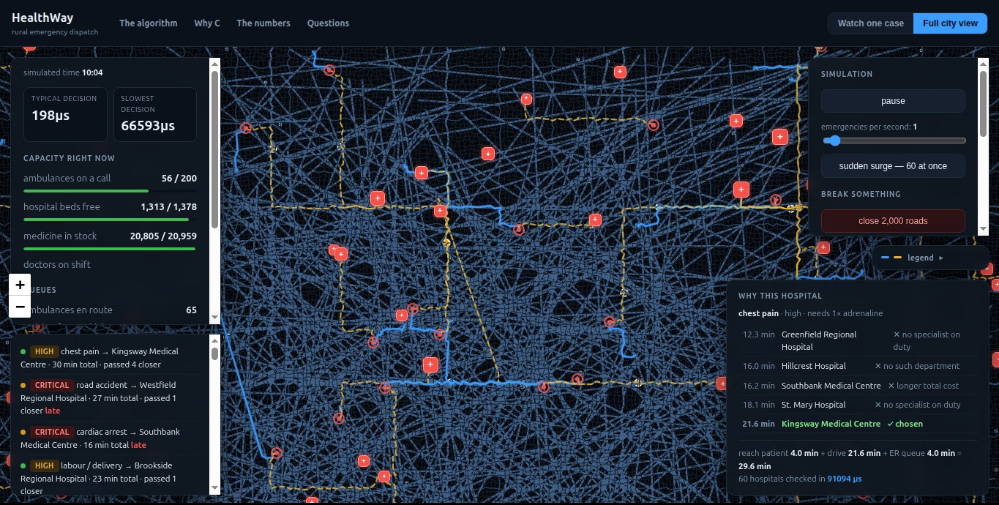
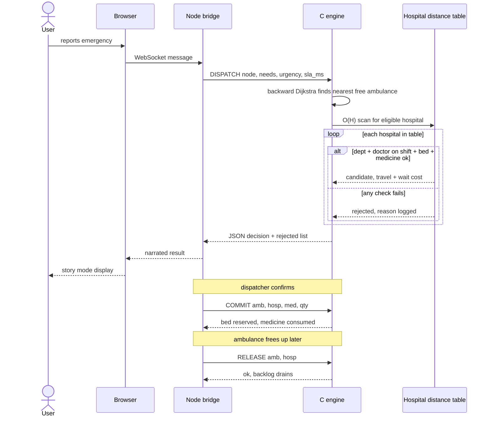
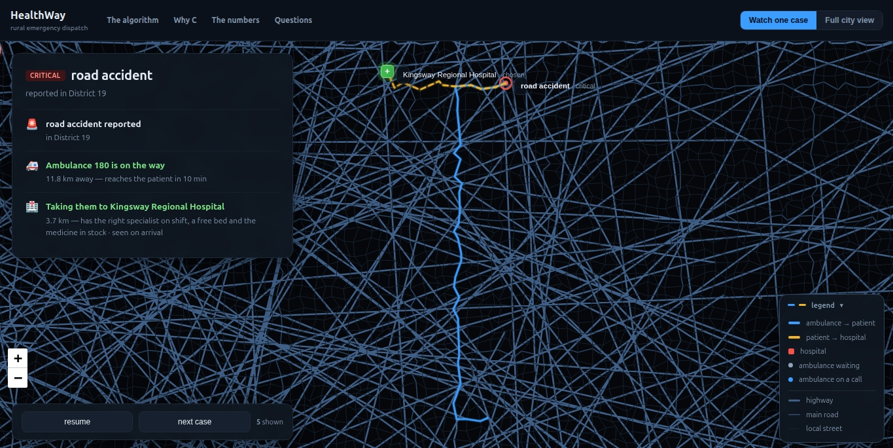

<p align="center">
  
</p>

<h1 align="center">HealthWay</h1>

<p align="center">
  <i>The nearest hospital is usually the wrong hospital.</i><br/>
  A rural emergency dispatch engine that decides which ambulance goes and which hospital can <b>actually treat the patient</b> — in 50 millionths of a second.<br/>Then it names every hospital it turned down, and exactly why.
</p>

<p align="center">
  <a href="#-the-problem">The problem</a> ·
  <a href="#-the-algorithm">The algorithm</a> ·
  <a href="#%EF%B8%8F-why-c">Why C</a> ·
  <a href="#-the-numbers">The numbers</a> ·
  <a href="#-quick-start">Quick start</a> ·
  <a href="#%EF%B8%8F-architecture">Architecture</a> ·
  <a href="#-why-you-can-trust-it">Trust</a>
</p>

<p align="center">
  
  
  
  
  
  
  
</p>

<p align="center">
  <sub><code>50,000 junctions</code> · <code>200,100 roads</code> · <code>5,000 villages</code> · <code>60 hospitals</code> · <code>200 ambulances</code> · <code>420 doctors on rotating shifts</code></sub>
</p>

---

## At a glance

- **It optimises time to *treatment*, not distance** — the objective is `travel time + queue wait`, which routinely sends a patient *past* the nearest hospital to one that will actually see them an hour sooner.
- **Capacity-aware, and honest about it** — departments, **doctors physically on shift right now**, free beds and medicine stock are all hard constraints. A cardiology ward with no cardiologist at 3 a.m. is correctly refused.
- **50.8 µs per decision** — about **19,671 dispatches per second on one core**, examining under 1% of a 50,000-junction map.
- **Exact, not approximate** — every shortcut is cross-checked against full Dijkstra *and* per-candidate A\*: **0 mismatches over 300 requests**. No optimality was traded for the speed.
- **It explains itself** — the same scan that picks the winner records why each of the other 59 hospitals lost: *no such department · no specialist on duty · no free bed · out of medicine · unreachable · eligible but slower*.
- **Survives the bad day** — 4,000 simultaneous emergencies dispatched in **412 ms**; a road closes in **107 ns**.
- **Written from scratch in C** — ~2,000 lines, nothing beyond libc and pthreads. An entire district fits in **under 20 MB**, which is the difference between a system that gets deployed to a rural district and one that never leaves the slide deck.
- **A live simulation you can drive** — story mode narrates one case at a time in plain English; city view runs the whole district under load, with controls to close 2,000 roads or jump to the night shift. **Zero npm dependencies.**
- **It runs on real hospitals too** — a third mode loads the **actual roster of 34 Indian cities, 461 real hospitals** with their published departments, ownership and bed counts, and swaps the whole world in ~300 ms. In Pune exactly one hospital of 24 runs a burns unit, so every burns call in the city is driven to the same place. The map underneath is still generated, and the UI says so.

<p align="center">
  
</p>

<p align="center">
  <sub>🌆 <b>Full city view</b> — the whole district live. Decisions on the left, capacity in the middle, and on the right the <b>“why this hospital”</b> panel naming every hospital that was rejected and the reason for each.</sub>
</p>

---

## 🩸 The Problem

> Someone in a village collapses. Someone else picks up a phone.
> Right now, in much of rural India, **what happens next is a guess.**

A human guesses which ambulance is closest and which hospital to send the patient to. Guessing costs lives — because the closest building is very rarely the closest *treatment*.

There are **four** ways "just send them to the nearest hospital" kills people:

| ❌ | Failure | What it looks like |
|:--:|---|---|
| **1** | **No department** | A burst appendix arrives at an eye clinic |
| **2** | **No doctor on shift** | It's 3 a.m. The cardiology ward exists. The cardiologist went home at 10 p.m. |
| **3** | **No bed, no medicine** | Right specialist, zero free beds — or zero adrenaline left |
| **4** | **The queue** | 10 minutes away, 40 people already waiting |

And the second journey — the transfer from the wrong hospital to the right one — is very often the one that kills.

---

## 💡 The Core Insight

Everything in this project follows from one comparison:

<div align="center">

| | 🏥 **Hospital A** | 🏥 **Hospital B** |
|---|:---:|:---:|
| Drive time | **10 min** | 25 min |
| People waiting | 40 | 0 |
| Queue wait | 90 min | 0 min |
| **Time until treated** | **100 min** | **25 min** ✅ |

</div>

Hospital **B wins by over an hour** — and *every* "nearest hospital" system on earth sends the patient to A.

> ### 🎯 This project does not minimise travel time.
> ### It minimises **travel time + waiting time**.

That is a completely different — and much harder — question. It means checking, for every hospital, whether the department exists, whether a specialist is **physically on shift right now**, whether a bed is free, whether the medicine is in stock, and how long the queue is. All while roads close, ambulances get consumed, beds fill up, and doctors change shift.

**The answer to "where should this patient go" is different every single time you ask it** — even for two identical patients ten seconds apart.

---

## 🧠 The Algorithm

*The clever part, in five moves. Full proofs and pseudocode live in [docs/ALGORITHM.md](docs/ALGORITHM.md).*

### 🌊 Move 0 — Dijkstra, explained without maths

The road map is just **junctions** and **drive times between them**. To find the fastest route from a junction, imagine pouring water there. It spreads down every road at driving speed. The moment water reaches a junction, you know the fastest route to it — because water always takes the quickest path available, and nothing arriving later could have been faster.

That's Dijkstra's algorithm (1956). A **priority queue** answers "which junction is closest right now?" instantly, turning 2.5 billion comparisons into something that finishes in microseconds.

### ✂️ Move 1 — Separability: 12,000 calculations become 2

The naive approach: for each of 200 ambulances × each of 60 hospitals, compute both routes. **12,000 route calculations. Measured at 182 milliseconds per patient.** Under a bus crash or a flood, it collapses.

But look at what's actually being minimised:

```
total  =  time(ambulance → patient)  +  time(patient → hospital)  +  wait at hospital
          └──── no hospital here ────┘   └──────── no ambulance in either of these ────────┘
```

**The two halves are mathematically independent.** Which ambulance you send has *zero* effect on which hospital is best. So instead of 200 × 60 combinations, solve two small separate problems.

> 🏆 **12,000 calculations → 2.** The single biggest reason this engine is fast.

### 🔄 Move 2 — Search backwards, not forwards

Don't search *from* each of 200 ambulances *to* the patient. Search **outward from the patient along the roads in reverse**. The first free, correctly-equipped ambulance the search touches is *provably* the closest one — so it stops immediately.

**200 searches → 1**, and it settles just **359 junctions out of 50,000** (under 1% of the map) before quitting.

### ⚠️ Move 3 — The trap: waiting time breaks the early exit

This is the subtle part, and it's what most systems get wrong.

If you search outward for a hospital and stop at the first one you reach, you get Hospital A from the table above — **and you are an hour wrong.** The correct stopping rule is one line:

```c
if (d >= best_total) break;   /* provably done */
```

*Keep searching outward until the frontier is further away than the best complete answer you already have.* Still exact — but it costs. Measured: **7,631 junctions settled** versus 359, with the hospital side eating **81% of all runtime.**

> 📄 **Where this comes from.** Expanding outward from the query point along the
> road network and retrieving candidates as you reach them is **INE — Incremental
> Network Expansion** — from *Query Processing in Spatial Network Databases*
> (Papadias, Zhang, Mamoulis & Tao, **VLDB 2003**, pp. 802–813), the paper that
> established how to do nearest-neighbour search on a road network rather than in
> open space. **The hospital search is INE**, and the debt is worth stating plainly.
>
> What this project has to add is the consequence of the cost function. INE ranks
> candidates by **network distance**, so the expansion can stop the moment it has
> its answer. Here the cost is **travel + queue wait**, and the wait term is not
> spatial at all — a hospital three minutes further out with a twenty-minute
> shorter queue wins. So the frontier can no longer stop at the first hospital; it
> must run until the frontier distance exceeds the best **total** found so far,
> since travel time alone is a lower bound on any candidate still unreached.
> Same expansion, different — and more expensive — termination proof.

> 🔬 That 81% was only found by **measuring the two searches separately**. Two earlier optimisations, both built on intuition, delivered *approximately zero* improvement. **Profile first, guess never.**

### ⚡ Move 4 — The fix: a hospital distance table

There are only **60 hospitals**. So run Dijkstra backwards from every hospital *once, in advance*, and write down the drive time from all 50,000 junctions to each of them.

Now answering a query isn't a search at all — it's a **scan of 60 numbers**:

```
for each of the 60 hospitals:
      has the department?          → one AND, one compare
      specialist on shift now?     → one AND, one compare
      bed free?  medicine in stock?→ one compare each
      score = table[patient][hospital] + queue_wait(hospital)
      keep the smallest, remember every reject and why
```

<div align="center">

| Hospital-side approach | Per dispatch | Junctions searched | Correct with queues? |
|---|:---:|:---:|:---:|
| Stop at first eligible | 286 µs | 1,635 | ❌ **wrong answer** |
| Bounded search | 1,314 µs | 7,631 | ✅ |
| **Distance table** | **51 µs** | **0** | ✅ |

</div>

> 🎁 **26× faster, with identical answers** — and because it now looks at *every* hospital anyway, the **rejection list comes free.** That list is what powers the decision log.

### 🎛️ Move 5 — Bitmasks, shifts, and the horizon

**Capabilities are bits, not text.** Trauma is bit 0, cardiac bit 1, obstetrics bit 4, ICU bit 7. Checking a hospital is `(has & needs) == needs` — **one AND, one compare**, no matter how many specialties exist. Adding ophthalmology is one more bit; the checking code doesn't change.

**Departments ≠ doctors.** Every hospital carries *two* masks: what it has at all, and what has a doctor **physically on shift right now**. 420 doctors, three rotating 8-hour shifts, recomputed on every clock tick. This is why routing at 3 a.m. differs from 10 a.m. — and why the log can say *"no specialist on duty"* (fixes itself by morning) instead of *"no such department"* (needs a new hospital).

**The horizon.** When every ambulance is busy, the backward search has nothing to stop on and sweeps the entire map — slowest exactly when the system is most loaded. Capping the search at 15 minutes of drive time fixes it:

<div align="center">

| 4,000-emergency surge | Total time |
|---|:---:|
| No horizon | 29,910 ms |
| **15-minute horizon** | **412 ms** ⚡ **72× faster** |

</div>

> ⚕️ **The horizon applies to the ambulance leg only — never the hospital leg.** An ambulance 40 minutes away is useless. A specialist burns centre 40 minutes away may be the only place on earth that can save this patient. There is a test guarding exactly this.

---

## ⚙️ Why C

> **Because the workload is millions of small, unpredictable memory accesses per second — and C is the language that lets you control exactly where every byte sits.**

This isn't nostalgia. Four concrete choices *are* the performance:

| Choice | What it means | Why it matters |
|---|---|---|
| 🗂️ **Flat arrays (CSR)** | Every road out of a junction sits *next to its siblings* in memory | The processor fetches 64 bytes at a time — fetch one road, get the rest free |
| 📦 **8-byte road records** | Destination + drive time packed together | One memory fetch gets both |
| 🎯 **16-byte search records** | Four land in a single cache line | Never surprise the memory system |
| 🔢 **One 64-bit int per queue entry** | Time in the top half, junction in the bottom | Comparing two entries is one integer compare — the cheapest thing a CPU does |

Plus a trick that's pure C: **generation stamps.** Starting a fresh search normally means wiping 50,000 entries — 800 KB of writing, to serve a search that touches only 359 junctions. Instead a counter is bumped by one, and anything tagged with an old counter is invisible. **An O(V) reset becomes O(1).**

<div align="center">

**The result: 50 µs decisions in under 20 MB of RAM.**

The same algorithm in Python lands in the tens of milliseconds — roughly a thousand times slower — and would not survive a surge.

</div>

There is a second reason, and it's about deployment: **under 20 MB for an entire district** runs on hardware that costs almost nothing. A rural health system that needs a server rack is a rural health system that never gets deployed.

The whole engine is **~2,000 lines of C**, using nothing beyond libc and pthreads. No graph library, no JSON library, no framework.

---

## 📊 The Numbers

*Every figure below comes from `./bench` on a **fixed random seed** (`0xc0ffee`) — identical dataset on every run, on every machine. Nothing here is estimated. Measured on a 2011 dual-core i3-2350M under frequency scaling, so these are a **floor**, not a target.*

<details open>
<summary><b>⏱️ Speed of a single decision</b></summary>

<br>

| Measure | Value |
|---|:---:|
| **Average** | **50.8 µs** |
| Median (p50) | 28.4 µs |
| p90 | 116 µs |
| p99 | 361 µs |
| Worst seen | 810 µs |
| **Throughput, one core** | **19,671 decisions/sec** |
| Junctions examined | **359 of 50,000** — under 1% |

> 👁️ For scale: a human blink is about 100,000 µs. **You could make two thousand dispatch decisions in one blink.**

</details>

<details open>
<summary><b>🏁 Versus the obvious approaches — same 200 emergencies, <i>identical answers</i></b></summary>

<br>

| Method | Average | How much slower |
|---|:---:|:---:|
| 🥇 **This engine (distance table)** | **50.8 µs** | — |
| Bounded Dijkstra ×2 | 1,308 µs | **26× slower** |
| Full Dijkstra ×2 + scan | 17,808 µs | **350× slower** |
| A\* per ambulance and hospital | 182,534 µs | **3,593× slower** |

That last row is the naive approach: nearly a fifth of a second per patient. Under any real surge it collapses completely.

</details>

<details open>
<summary><b>🎯 Correctness — the row that matters most</b></summary>

<br>

> ### **300 emergencies cross-checked against full Dijkstra *and* per-candidate A\*.**
> ### **Mismatches: 0.**

Fast is only interesting if it's also right. Every shortcut — the early exit, the separability argument, the distance table, the horizon — is checked against the slow, obviously-correct method. **No optimality was traded away for the speed.**

</details>

<details>
<summary><b>💾 Memory — an entire district in under 20 MB</b></summary>

<br>

| Component | Size |
|---|:---:|
| Road network (50k junctions, 200k roads) | **6.30 MB** |
| Hospitals, ambulances, doctors | 34.6 KB |
| Hospital distance table | 11.44 MB |
| Search workspace, per thread | 1.14 MB |

</details>

<details>
<summary><b>📈 Latency is flat as the map grows 100×</b></summary>

<br>

| Junctions | Roads | Decision time | Table memory | Table build |
|---:|---:|:---:|---:|---:|
| 2,000 | 7,860 | 51 µs | 0.03 MB | 1.3 ms |
| 20,000 | 79,830 | 55 µs | 1.9 MB | 85 ms |
| **50,000** | **200,100** | **50 µs** | **11.6 MB** | **681 ms** |
| 200,000 | 802,200 | **57 µs** | 183.9 MB | 11.7 s |

**A 100× larger network costs 12% more per query.** That's the payoff of the distance table — a query scans the hospital list, and the hospital list doesn't grow just because the map does. The price shows up in the last two columns instead, stated plainly.

</details>

<details>
<summary><b>🚧 Road closures, surges, cores and the network</b></summary>

<br>

**Dynamic road closures**

| | |
|---|:---:|
| Close one road, both directions | **107 ns** — constant time, any map size |
| Close 4,000 roads | 0.858 ms |
| Rebuild the distance table afterwards | **672 ms** ← the honest cost |
| Decision speed after closures | 52.0 µs — statistically unchanged |

**Surge — 4,000 simultaneous emergencies**

| | Total | Average decision |
|---|:---:|:---:|
| No horizon | 29,910 ms | 5,853 µs |
| **With 15-min horizon** | **412 ms** | **92 µs** |

Waiting-list performance: **27 ns to add, 307 ns to remove**, over a million entries, urgency ordering verified correct.

**Multiple cores** — the graph and table are read-only and shared with *zero locks*

| Threads | Decisions/sec | Speedup |
|:---:|:---:|:---:|
| 1 | 16,519 | 1.00× |
| 2 | 32,314 | **1.96×** |
| 4 | 44,219 | 2.68× |

**Over TCP, end to end, including JSON**

| Setup | Decisions/sec |
|---|:---:|
| 1 client, waiting for each reply | 3,645 |
| **8 pipelined clients** | **42,616** |

The single-client figure is bound by round trips, not by the engine — which is exactly why the bridge pipelines.

</details>

---

## 🚀 Quick Start

**No `npm install`. No build step for the web. No dependencies beyond libc, pthreads and a bare Node install.**

You need exactly two things: a **C11 compiler with `make`**, and **Node.js 18+**. Nothing else — there is no package manager step anywhere in this project.

<details open>
<summary><b>🐧 Linux</b> — Debian / Ubuntu, Fedora, Arch</summary>

<br>

**1. Install the toolchain**

```bash
# Debian / Ubuntu
sudo apt update && sudo apt install -y build-essential nodejs git

# Fedora / RHEL
sudo dnf install -y gcc make nodejs git

# Arch
sudo pacman -S --needed base-devel nodejs git
```

Check both are present:

```bash
cc --version && make --version && node --version
```

**2. Get the code and build it**

```bash
git clone https://github.com/Junior-paradox/HealthWay.git
cd HealthWay
make                # builds bench, server and tests — a few seconds
make test-all       # 74 engine assertions + 31 protocol assertions
```

**3. Run the live simulation** — two terminals, or one with `&`

```bash
./server 9090       # terminal 1: the C engine daemon
node web/bridge.js  # terminal 2: the Node bridge + web server
```

Then open **<http://127.0.0.1:8080>** 🗺️

**Stopping it:** `Ctrl-C` in each terminal. If you backgrounded them, `pkill -f './server 9090'` and `pkill -f 'web/bridge.js'`.

</details>

<details>
<summary><b>🪟 Windows</b> — via WSL2 (recommended)</summary>

<br>

The engine is written against POSIX sockets and pthreads (`sys/socket.h`, `netinet/in.h`, `pthread.h`), so it does **not** compile with plain MSVC or MinGW without a Winsock port. **WSL2 runs it natively and is the supported path** — the binary is a real Linux binary, at full speed, and the browser side works from Windows unchanged.

**1. Install WSL2** — in PowerShell **as Administrator**:

```powershell
wsl --install -d Ubuntu
```

Reboot if prompted, then open **Ubuntu** from the Start menu and set your username and password.

**2. Inside the Ubuntu shell, install the toolchain**

```bash
sudo apt update && sudo apt install -y build-essential nodejs git
cc --version && make --version && node --version
```

> If Ubuntu's `nodejs` is older than 18, install a current one:
> ```bash
> curl -fsSL https://deb.nodesource.com/setup_20.x | sudo -E bash - && sudo apt install -y nodejs
> ```

**3. Get the code and build it**

Clone **inside the WSL filesystem** (`~/`), not under `/mnt/c/` — cross-filesystem builds are dramatically slower.

```bash
cd ~
git clone https://github.com/Junior-paradox/HealthWay.git
cd HealthWay
make
make test-all
```

**4. Run it** — two Ubuntu terminals:

```bash
./server 9090       # terminal 1: the C engine daemon
node web/bridge.js  # terminal 2: the Node bridge + web server
```

**5. Open it in your Windows browser** — go to **<http://127.0.0.1:8080>** 🗺️

WSL2 forwards `localhost` to Windows automatically, so no extra configuration is needed. If the page doesn't load, run `wsl hostname -I` in PowerShell and use that address instead.

**Editing from Windows:** VS Code with the *WSL* extension opens the repo in place — run `code .` from the Ubuntu shell inside the project directory.

</details>

### 🎛️ Everything the Makefile does

| Command | What it does |
|---|---|
| `make` | Portable build — `bench`, `server` and `tests` |
| `make test` | 86 engine assertions, exits non-zero on failure, under a second |
| `make test-protocol` | 44 protocol assertions against a live daemon on a scratch port |
| `make test-all` | Both of the above |
| `make serve` | Shorthand for `./server 9090` |
| `make quick` | `./bench --quick` — benchmark in ~40 s |
| `make run` | `./bench` — the full sweep |
| `make city-data` | Regenerates `src/city_data.h` from the published hospital dataset — the only target that touches the network, and never run by `make` |
| `make clean` | Removes objects and binaries |

**Ports** are overridable without editing anything: the bridge reads `PORT` (web, default 8080) and `ENGINE_PORT` (engine, default 9090).

```bash
./server 7000
PORT=3000 ENGINE_PORT=7000 node web/bridge.js
```

> 🛡️ The build is **portable by default**. `-march=native` is opt-in via `make NATIVE=1`, because a binary built with it targets the build machine's exact CPU and will `SIGILL` on an older one. Header dependencies are tracked (`-MMD -MP`), so editing a `.h` actually triggers a rebuild instead of silently leaving a stale object behind.

---

## 🏗️ Architecture

Three pieces. Think of it as a restaurant: a kitchen, a waiter, and a dining room.

```
   YOUR BROWSER                  THE BRIDGE                THE ENGINE
   (the dining room)             (the waiter)              (the kitchen)

   web/index.html      <────>    web/bridge.js    <────>   ./server
   map, live meters,             Node.js,                  C program,
   decision log                  zero libraries            does the thinking

              WebSocket                    TCP socket, port 9090
```

| 🍳 **The Engine** | `src/` · ~2,000 lines of C |
|---|---|
| Holds the entire district in memory — every road, hospital, bed, medicine batch, doctor roster and ambulance. Ask it a question, get an answer in ~50 µs. It **stays running**: booting costs 12 ms for the graph plus 670 ms for the table, so paying that per emergency would be ~13,000× slower. It also has no idea a browser exists — you could put a phone system or a real dispatcher's console in front of it without changing a line of C. |

| 🤵 **The Bridge** | `web/bridge.js` · ~450 lines, **zero outside libraries** |
|---|---|
| Serves the page, translates WebSocket ↔ the engine's plain-text protocol, and **runs the simulation**: a 60×-speed clock, an emergency generator, an urgency-ranked waiting list, and case lifecycles. It holds **four pipelined connections** to the engine. Even the **RFC 6455 WebSocket implementation is written by hand** — handshake, frame masking, length encoding — using only Node's built-in `crypto`. |

| 🍽️ **The Map** | `web/index.html` · plain HTML + Leaflet |
|---|---|
| No React, no bundler, no build step. Draws **100,050 road segments** without dying, via canvas rendering, merged multi-polylines, and zoom gating. No tile server is contacted — the demo runs with no internet. |

**Why split it this way?** C is fast but painful for web work. JavaScript is easy for web work but far too slow for millions of graph operations. So the heavy thinking is C, the plumbing is JavaScript, and they talk over a socket.

### 🔄 The full request lifecycle

One emergency, all the way through — browser to bridge to engine to the hospital
table, and on through `COMMIT` and `RELEASE`.



Two details worth catching in that diagram. The **rejected list is produced by the
same scan that picks the winner** — explaining the decision costs nothing extra.
And **nothing is reserved until `COMMIT`**: a dispatch answer is a recommendation,
so the bed, the queue slot and the medicine are only taken when the dispatcher
confirms.

<details>
<summary><b>🔌 The protocol — plain text, one command per line</b></summary>

<br>

Plain text on purpose: you can drive the entire engine from a terminal with `nc localhost 9090` and no tooling whatsoever.

```
DISPATCH <node> <need_hosp> <need_amb> <need_med> <qty> <urgency> <sla> <horizon> <geom>
COMMIT <amb> <hosp> <med> <qty>     reserve vehicle, bed and medicine
RELEASE <amb> <hosp>                vehicle back in service, queue drains
CLOCK <ms>                          set time of day; redrives doctor shifts
RESTOCK <hosp> <med> <qty>          replenish a medicine batch
CLOSE <edge> | OPEN <edge>          road closure, O(1)
REBUILD                             rebuild the distance table
ROADS <class> <from>                road geometry, paginated
HOSPITALS | FLEET | BOUNDS | NODE | STATS | QUIT
```

Every dispatch reply carries the decision **and its justification**:

```json
{"ok":true,"amb":69,"hosp":2,"t_scene_ms":690000,"t_hosp_ms":1278000,
 "wait_ms":0,"t_total_ms":1968000,"considered":60,"latency_us":53,
 "rejected":[{"hosp":35,"travel_ms":642000,"why":"no specialist on duty"},
             {"hosp":42,"travel_ms":750000,"why":"no specialist on duty"},
             {"hosp":57,"travel_ms":1050000,"why":"no such department"}]}
```

</details>

<details>
<summary><b>🧭 The same lifecycle again, with real values</b></summary>

<br>

1. 📞 The clock ticks; an emergency is generated — say **labour / delivery**.
2. 📋 That case type carries real requirements: **obstetrics** department, **neonatal-equipped** ambulance, 1 unit of oxytocin, urgency 2.
3. 📨 One line of text goes down a socket: `DISPATCH 34102 16 1024 4 1 2 900000 900000 1`
4. 🧮 The engine finds the nearest free neonatal ambulance, then scans all 60 hospitals for the one minimising *drive + drive + queue*, checking departments, on-duty doctors, beds and stock.
5. 📤 It replies with JSON: chosen ambulance, chosen hospital, both road paths, the times, and **every rejected hospital with its reason**.
6. ✅ The bridge sends `COMMIT` — which actually takes the bed, joins the queue, and consumes the medicine — then forwards it all to the browser.
7. 🗺️ The browser draws both routes, updates the meters, writes a decision-log line, and fills the "why" panel.
8. 🔓 When the case finishes, `RELEASE` frees the ambulance and the bed. **The medicine does not come back** — it was used. Only an explicit `RESTOCK` returns it.

</details>

---

## 🖥️ What You See

One page, three modes, one socket — because very different people look at this project.

### 📖 Story mode *(the default)*

One emergency at a time, slowly, narrated in plain English. The map flies to the village. Candidate hospitals appear with readable labels. Rejected ones get a **red ✕ and the reason written next to them**. The chosen one gets a **green ✓** and its total time.

<div align="center">



<sub>📖 <b>Story mode</b> — one case, told in full sentences. Blue is the ambulance reaching the patient; amber is the patient reaching the hospital.</sub>

</div>

```
🚨  Road accident reported in District 12
🔎  Checking every ambulance and hospital…  60 hospitals reachable
🚑  Ambulance 171 is on the way — 9.5 km away, reaches the patient in 13 min
🏥  Taking them to Oakwood Hospital — specialist on shift, bed free, medicine in stock
❌  Not Sunrise Regional — only 9.6 min away, but no specialist on duty
❌  Not Highland Regional — only 12.6 min away, but no specialist on duty
    total time to treatment 26 min · decided in 1,129 µs
```

Ten case types cycle through, each carrying its **real** clinical requirements:

| Complaint | Hospital needs | Vehicle needs | Consumes |
|---|---|---|---|
| 🚗 Road accident | trauma | ALS + ventilator | 2× analgesic |
| 💔 Cardiac arrest | cardiac | ALS + ventilator | 2× adrenaline |
| 🧠 Stroke | neuro | ALS | 1× anticoagulant |
| 👶 Labour / delivery | obstetrics | **neonatal** | 1× oxytocin |
| 🔥 Severe burns | burns | ALS | 3× burn dressing |
| ☠️ Poisoning | toxicology | ALS | 2× antivenom |
| 🧸 Paediatric emergency | paediatrics | — | 1× paediatric AB |
| 🏥 Critical transfer | ICU **and** cardiac | ALS + ventilator | 1× sedative |

> This is the answer to *"is the specialist routing real, or just a label?"* — the requirement is a bitmask that **genuinely excludes hospitals**, and you can watch it exclude them.

### 🌆 Live city view

*Pictured at the top of this page ↑*

The whole district under load: hundreds of emergencies flowing, ambulances moving on real roads, **live telemetry** (decision time, fleet utilisation, bed and medicine meters, doctors on shift, queue depth, SLA met %), the **decision log** scrolling, and a **"why this hospital"** panel carrying the full reasoning for the latest call.

Controls that break things on purpose: change the emergency rate, inject a surge, **close 2,000 roads**, restock medicine, and **jump between the day and night shift** so the staffing map visibly changes. These are not animations — the C engine is genuinely recomputing.

### 🏙️ Real city

The same engine, loaded with the **actual hospital roster of a real Indian city**. Pick Mumbai, Pune, Bangalore, Delhi, Chennai, Hyderabad, Kolkata or Ahmedabad — 34 cities in all, **461 real hospitals** — and the district is swapped out in about 300 ms: new roster, new fleet, new distance table, same code path.

Now the decision log stops saying *"Oakwood Hospital"* and starts saying this:

```
🚨  Severe burns reported in zone 9 of the Pune roster
❌  Not Inlaks and Budhrani Hospital  —  3.7 min away, no such department
❌  Not Sancheti Hospital             — 10.9 min away, no such department
❌  Not Deenanath Mangeshkar Hospital — 14.2 min away, no such department
❌  Not Sanjeevan Hospital Pune       — 14.9 min away, no such department
🏥  Taking them to Sassoon General Hospital — 1,300 beds, government, Near Pune Railway Station
    all 24 hospitals checked · total time to treatment 33 min
```

Burns is the case worth watching. Across all 24 Pune hospitals **exactly one** runs a burns unit, so **every** burns call in the city is driven to the same place — mean time to treatment **33.3 min**, against **21.6 min** for chest pain, which nearly every hospital can take. That is not a tuned demo; it is what the roster says.

Switch to the **night shift** and the destinations move. On a sample of 120 calls in Pune, **every poisoning case and every paediatric case** goes somewhere different at 03:00 than it did at 10:00 — *Inlaks and Budhrani Hospital → Sanjeevan Hospital Pune* — because the specialist who was on at ten has gone home.

#### 🔬 What is real here, and what is not

This matters more than the feature does, so it is written on the panel itself, not buried:

| | |
|---|---|
| ✅ **Real** | Hospital names, wards, ownership (private / government / trust), reported bed counts, NABH accreditation, and the departments each hospital publishes — 461 hospitals across 34 cities |
| 🟡 **Inferred** | 40 department designations, flagged in amber in the tooltip. Hospital websites list what they *market*, and burns and poisoning are not marketed — 29 of the 34 cities list no burns unit at all. Where a city listed none, the capability is handed to its largest public hospital, which is what a real state referral network leans on. The UI says so on every one |
| ❌ **Simulated** | The street layout, **where each hospital sits on it**, the ambulances, the doctors and their shifts, the medicine, and the queues. **The dataset carries no coordinates** — so the map is a generated grid, not Mumbai |

That last row is the honest limit of this mode. It is a **real roster on a synthetic map**, and the UI never names a real neighbourhood for an incident, only *"zone 9 of the Pune roster"*. Real coordinates and real streets would come from OpenStreetMap, and that is still the swap-in described under [Honest Limitations](#-honest-limitations).

The roster is **compiled into the binary** (`src/city_data.h`, 34 KB), not fetched. A dispatch daemon that needs an internet round trip to learn which hospitals exist is exactly the thing this project argues against, and a rural district is where the connection is worst. `make city-data` regenerates it on purpose, and the diff is reviewable.

### 🗣️ Plain language everywhere

A deliberate rule: **nothing on screen uses jargon without translating it.**

| Not this | But this |
|---|---|
| `CAP_OBSTETRIC` | "maternity" |
| `REJ_NO_DOCTOR` | "the specialist is off shift right now" |
| `p50 latency 28.4 µs` | "decision made in under a thousandth of a second" |
| node `34102` | "a village in the north-east district" |

---

## ✅ Why You Can Trust It

**Two suites, 130 assertions**, both exiting non-zero on failure. Full test plan with per-case IDs and a requirement→test traceability matrix: **[docs/TESTING.md](docs/TESTING.md)**.

```
make test          src/test.c                86 checks — the engine, in-process
make test-protocol scripts/protocol_test.sh  44 checks — the daemon, over TCP
make test-all      both                     130 checks, 0 failed, under 4 s
```

<details>
<summary><b>What the tests actually pin down</b></summary>

<br>

- 🎯 The distance table agrees with the bounded search, a full exhaustive Dijkstra, a per-candidate A\*, **and** a **Bellman-Ford reference that shares no code with any of them** — so a bug in the common heap or the generation-stamp reset cannot hide.
- ⏳ **Swamping the chosen hospital's queue genuinely diverts the patient to one further away by road**, and the new choice still matches exhaustive search. This is the property a plain travel-time index cannot express.
- 🚫 Each constraint refuses on its own — no department, no doctor on shift, no bed, no medicine, no free vehicle — and **restocking one hospital revives routing to exactly that hospital**.
- 🛣️ Reconstructed routes are checked **edge by edge** against the road network, and re-summing the segments reproduces the reported drive time exactly.
- 🔌 A junction cut off by closures reaches zero hospitals — and reopening restores the **byte-identical decision and byte-identical distance table**.
- 🕒 Some cases route differently at 03:00 than at 10:00.
- 🚨 A critical case preempts everything already queued; equal urgency is served oldest-first; randomised interleavings always yield the true most-urgent case.
- 💊 One commit takes exactly one bed, one vehicle and one queue slot — and **medicine does not come back on release**, only on restock. ("Resources that quietly regenerate" is the most common way a simulation flatters its own numbers.)
- 📏 A horizon exactly equal to the drive time accepts the vehicle; one millisecond tighter refuses it.

</details>

<details open>
<summary><b>🧪 The suite is verified to fail</b></summary>

<br>

Early on, the constraint-checking function was **deliberately broken** to see whether the tests would notice. They reported all passes.

The cause was a build bug: the Makefile didn't track header dependencies, so editing a `.h` didn't rebuild the `.c` files including it — the tests had been quietly running against a **stale binary**. The build was fixed (`-MMD -MP`), the sabotage repeated, and the failure appeared as it should have the first time.

Six single-line mutations have since been injected and each was caught by the right assertions — including reverting the hospital search to the naive "stop at the first eligible hospital", which immediately breaks two checks. Full table in [docs/TESTING.md](docs/TESTING.md#6-mutation-testing-proof-the-suite-can-fail).

> **A test suite you have never watched fail is not evidence of anything.**

</details>

---

## 🔍 Honest Limitations

*Stated plainly, because a benchmark that only reports good news is marketing.*

| Limitation | Detail |
|---|---|
| 🎲 **Synthetic roads** | The road network is a generated 250×200 grid with three realistic road classes (90/50/29 km/h), from a fixed seed — for reproducibility and scale-on-demand. **Real hospital rosters are now loaded** (34 cities, 461 hospitals; see [Real city](#-real-city)) but the published dataset carries **no coordinates**, so those hospitals still sit on the generated grid. Real streets and real positions would come from OpenStreetMap via Overpass, feeding the same `graph_build`. **It's a data-loading job, not an algorithm change** — and it is the half that has not been done. |
| 🚦 **Traffic is static** | The engine already stores a base drive time separately from the current one *precisely* so a traffic multiplier can be applied. The live feed isn't written. |
| ⏱️ **672 ms table rebuild** | The honest price of the distance table, paid whenever the map changes. Fine for a district where roads close a handful of times a day. Wrong design if the map changes every second. |
| 📦 **Table grows as junctions × hospitals** | 184 MB at 200,000 junctions. Beyond that you'd partition the district or rebuild incrementally. |
| ⚖️ **Waiting time is a simple model** | `queue_length × 12 min ÷ doctors_on_duty`, capped at 6 hours. Real triage is more complicated. It's simple **on purpose**, so anyone can check it by hand. |
| 🏷️ **8 specialties** | Not a full clinical taxonomy. Adding one is a single extra bit. |

---

## 📚 Deep Dives

| Document | What's inside |
|---|---|
| 🧮 **[docs/ALGORITHM.md](docs/ALGORITHM.md)** | Problem model, objective function, why the decomposition is *exact*, pseudocode for each search, correctness proofs, complexity derivations, the three hospital-side designs and why two were rejected, alternatives considered |
| 🧪 **[docs/TESTING.md](docs/TESTING.md)** | 105 named test cases with IDs, six testing techniques and what each catches, mutation-testing evidence, requirement→test traceability matrix, known gaps |

### 📄 Prior work this builds on

Nothing here was invented from nothing. The two loads carried by this engine are both standing on published work, and it is worth naming which parts are borrowed and which are ours.

| Source | What it gave us |
|---|---|
| **E. W. Dijkstra**, *A Note on Two Problems in Connexion with Graphs*, **Numerische Mathematik 1** (1959), pp. 269–271 | The shortest-path method itself — the foundation of both the ambulance search and every backward search that builds the distance table |
| **D. Papadias, J. Zhang, N. Mamoulis & Y. Tao**, *Query Processing in Spatial Network Databases*, **VLDB 2003**, pp. 802–813 | **INE (Incremental Network Expansion)** — searching for the nearest facilities *along the road network* instead of by straight-line distance, expanding from the query point and collecting candidates as the frontier reaches them. This is the shape of the hospital search |
| **WIB Open Data** — *WIB India Hospitals Dataset 2026* (version 2026-05-06), [wibest.in/data](https://wibest.in/data/), **CC-BY 4.0** | The real-city rosters: 463 Indian hospitals with names, cities, addresses, ownership, reported bed counts, NABH accreditation and published specialties. Used under CC-BY 4.0 with attribution; 461 of them, across the 34 cities with a roster large enough to simulate, are compiled into `src/city_data.h`. The capability bits, the referral fallback and everything spatial are ours, and are marked as such in the UI |

**What this project contributes on top:**

1. 🧮 **The separability argument** — ambulance choice and hospital choice are provably independent, collapsing an `|A| × |H|` product search into two rooted at the incident.
2. ⏳ **A non-spatial term in the cost** — INE's termination is exact for network distance; add **queue wait** and the standard early exit silently returns wrong answers. The corrected rule bounds the frontier against the best *total*, not the best travel time.
3. ⚡ **Replacing the expansion entirely** — with only 60 facilities, precomputing one backward Dijkstra per hospital turns the query from an expansion into an **O(H) scan**, which is what makes latency flat from 2,000 to 200,000 junctions.
4. 🚑 **Capacity and staffing as first-class constraints** — INE asks *"which facilities are nearest?"*. This asks *"which can actually treat this patient, right now, at 3 a.m., with a bed free and the medicine in stock?"*
5. 📋 **The rejection log** — the same scan that picks the winner records why every other hospital lost.

*Full treatment of the derivations, and the alternatives that were considered and rejected (including Contraction Hierarchies), is in [docs/ALGORITHM.md](docs/ALGORITHM.md).*

---

<div align="center">

### 🩺 The one thing to look at

**Story mode. One cardiac arrest. At 3 a.m.**

Watch the two nearest hospitals get rejected — one has no cardiology department at all, one has the department but the cardiologist went home — and the patient sent to a third, further away, that can actually treat them.

*That single case contains the entire argument for why "send them to the nearest hospital" is the wrong answer.*

<br>

</div>
