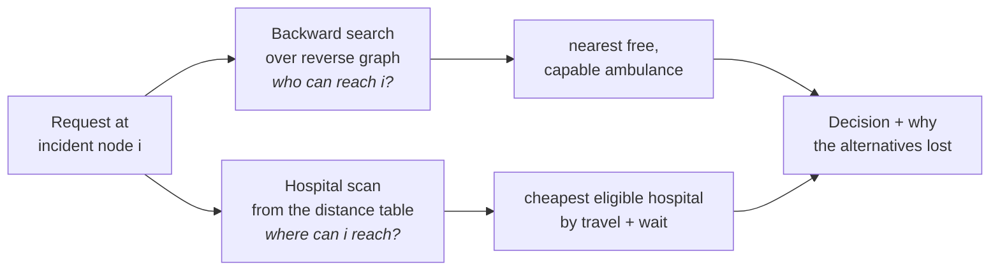

# HealthWay — Algorithm and Design

How the dispatch engine decides, why each decision is correct, and what each
one costs. Companion document: [TESTING.md](TESTING.md), which is the evidence
that the claims made here actually hold.

**Contents**

1. [The problem, stated precisely](#1-the-problem-stated-precisely)
2. [Why the obvious approach is wrong](#2-why-the-obvious-approach-is-wrong)
3. [The objective function](#3-the-objective-function)
4. [Decomposition: two independent searches](#4-decomposition-two-independent-searches)
5. [The ambulance side](#5-the-ambulance-side--backward-early-exit-dijkstra)
6. [The hospital side](#6-the-hospital-side--three-designs-one-survivor)
7. [Eligibility: the four constraints](#7-eligibility-the-four-constraints)
8. [Explainability](#8-explainability-the-decision-log)
9. [The backlog: a double-ended priority queue](#9-the-backlog-a-double-ended-priority-queue)
10. [Dynamic road closures](#10-dynamic-road-closures)
11. [Data structures and memory layout](#11-data-structures-and-memory-layout)
12. [Complexity summary](#12-complexity-summary)
13. [Alternatives considered and rejected](#13-alternatives-considered-and-rejected)
14. [Known limitations](#14-known-limitations)

---

## 1. The problem, stated precisely

**Given**

- A road network `G = (V, E)`, directed, with non-negative integer edge weights
  `w(e)` in milliseconds of drive time. Roads are stored as pairs of directed
  edges so each direction can be closed independently.
- A set of hospitals `H`, each located at a node, each carrying:
  - `spec_mask` — which departments physically exist there,
  - `on_duty_mask` — which of those have a specialist **on shift right now**,
  - `beds_free` — free inpatient beds,
  - `med[0..7]` — units in stock of each medicine batch type,
  - `queue_len`, `docs_on_duty` — which together give a queue wait.
- A set of ambulances `A`, each at a node, each with a `caps_mask`
  (advanced life support, ventilator, neonatal transport) and a busy flag.
- A set of doctors `D`, each attached to one hospital, holding one specialty,
  on duty only inside a shift window of a 24-hour cycle.

**A request** `r` names an incident node `i`, the hospital specialties it
requires (`need_hosp`), the vehicle equipment it requires (`need_amb`), a
medicine batch and quantity, an urgency 0–3, a response-time target, and an
optional response horizon.

**Find** the ambulance `a` and hospital `h` that get this patient into
treatment soonest, or prove that no legal pair exists.

**Scale it runs at.** 50,000 nodes, 200,100 directed edges, 60 hospitals, 420
doctors, 200 ambulances, 5,000 villages. Answers must come back in
microseconds, while roads close and the fleet saturates around them.

---

## 2. Why the obvious approach is wrong

The naive reading of the problem is *"find the nearest hospital"*. That is a
single-source shortest path query, solved and well understood.

It is also the wrong question. The nearest hospital is usually the **wrong**
destination:

| The nearest hospital… | …and so |
|---|---|
| has no cardiology department at all | it cannot take a cardiac arrest |
| has the department, but nobody on shift at 03:00 | a building with a locked door is not a destination |
| has the specialist, but every bed is full | the patient cannot be admitted |
| has all three, but the antivenom batch is out | the treatment cannot happen |
| has everything, and 40 people already waiting | a hospital twice as far away treats them sooner |

Each of those is a different *kind* of failure. Distance alone cannot express
any of them. The last one is the sharpest, because it breaks the shortest-path
formulation itself: **the optimum is no longer the nearest**, so no amount of
proximity indexing can produce it.

---

## 3. The objective function

The engine minimises **time to treatment**, not distance:

```
cost(a, h)  =  t(a → i)   +   t(i → h)   +   wait(h)
               ─────────      ─────────      ───────
               response       transport      queue
```

subject to `a` being free and carrying the required equipment, and `h` being
eligible on all four constraints of §7.

The queue term is the operational one:

```
                queue_len × 720 000 ms          (12 min of doctor time
wait(h)  =  min ─────────────────────── , 6 h )   per patient, shared
                  max(docs_on_duty, 1)           across doctors on shift)
```

Two consequences matter:

- `wait(h) ≥ 0` always. §6 depends on this.
- `wait` depends on `docs_on_duty`, which depends on the clock. The same
  request at 10:00 and at 03:00 can have different answers, and does — see
  test group 5.

---

## 4. Decomposition: two independent searches

The objective looks like a joint optimisation over `|A| × |H|` pairs — 12,000
combinations at full scale, each needing a shortest-path computation. It is
not.

**Claim.** `min over (a,h) of [ f(a) + g(h) ] = min over a of f(a) + min over h
of g(h)`, where `f(a) = t(a → i)` and `g(h) = t(i → h) + wait(h)`.

**Why.** The two terms share only the incident node `i`, which is fixed by the
request. The feasible set is a **rectangle** `A' × H'` — the ambulances that
qualify do not depend on which hospital is picked, and vice versa. Minimising
over a rectangle separates exactly. The result is not an approximation; it is
the same minimum.

So one joint search becomes two independent searches rooted at the same node:



This decomposition is what makes the whole thing affordable. It is also
exactly where the design would break if a future requirement coupled the two
halves — see [§14](#14-known-limitations).

---

## 5. The ambulance side — backward early-exit Dijkstra

`dispatch_nearest_ambulance()` in `src/dispatch.c`.

We need the nearest vehicle *to* the incident. Searching forward from every
ambulance would be `|A|` searches. Instead, search **backward from the
incident, once**, over the reverse graph: the settled distance at node `u` is
then the drive time `u → i`, which is the direction an ambulance actually
travels.

```
 1  reset the workspace                       (O(1) — generation stamp, §11)
 2  dist[i] ← 0 ;  push (0, i)
 3  while the heap is not empty:
 4      (d, u) ← pop the smallest key
 5      if d > dist[u]:  continue             (stale entry, lazy deletion)
 6      if horizon > 0 and d > horizon: break (nothing useful remains)
 7      for each ambulance a parked at u:
 8          if a is free and (a.caps & need) == need:
 9              return (a, d)                 ← first hit is optimal
10      for each reverse edge (u ← v) with weight w ≠ ∞:
11          if d + w < dist[v]:  dist[v] ← d + w ;  parent[v] ← u ;  push
12  return "no ambulance"
```

**Correctness of the early exit (line 9).** Dijkstra settles nodes in
non-decreasing order of distance, which requires only that all weights are
non-negative — guaranteed here, since every road costs at least 1 ms and closed
roads are skipped outright rather than given a negative or zero weight
(asserted by test U-9.4). So when node `u` is settled at distance `d`, every
node not yet settled has distance `≥ d`. Any other qualifying vehicle
therefore has response time `≥ d`. Returning immediately is optimal, not
greedy.

This works **only because there is no per-vehicle penalty** to trade against
distance. The moment a vehicle carries its own cost term, this early exit
becomes unsound in exactly the way described in §6 — which is what happens on
the hospital side.

**Measured:** ~360 nodes settled out of 50,000, i.e. 0.7% of the network.

**The horizon (line 6).** Under fleet saturation there may be no free vehicle
at all, and the search degenerates into a full sweep of the network before
concluding so. A per-request horizon caps that: 72× faster (29,910 ms → 412 ms
for 4,000 requests). It applies to the **response leg only**. A vehicle 40
minutes away is useless; a specialist centre 40 minutes away may be the only
place that can treat the patient, so the transport leg is never horizon-capped.
That asymmetry is deliberate and is asserted by test U-8.3.

---

## 6. The hospital side — three designs, one survivor

This is the part of the problem that is actually interesting, so all three
approaches are implemented in the repository and cross-checked against each
other.

### 6.1 Design A — early-exit search (wrong)

Mirror the ambulance side: search forward from the incident, stop at the first
eligible hospital.

**This is incorrect.** With a queue term, the first hospital reached is not the
cheapest: a hospital 3 minutes further out with a 20-minute shorter queue
wins. The early-exit argument of §5 fails precisely because `g(h)` is no longer
monotone in the settled order.

Kept in the repo only as the thing the other two are measured against. Test
group 2 constructs this exact situation and asserts the engine does *not* fall
for it.

### 6.2 Design B — bounded search (`dispatch_search_hospital`, correct)

Keep searching past the first hit, and stop on a provable bound.

```
 1  dist[i] ← 0 ;  push (0, i) ;  best ← ∞
 2  while the heap is not empty:
 3      (d, u) ← pop the smallest key
 4      if d > dist[u]:  continue
 5      if d ≥ best:  break                   ← termination rule
 6      if a hospital h sits at u and h is eligible:
 7          if d + wait(h) < best:  best ← d + wait(h) ;  record h
 8      relax the forward edges of u
 9  return the recorded h
```

**Correctness of line 5.** Let `B` be the best total cost found so far and `δ`
the current frontier key. Every hospital not yet settled has travel time
`≥ δ`, because Dijkstra settles in non-decreasing order. Since `wait ≥ 0`
always (§3), any such hospital has total cost `≥ δ + 0 = δ`. So if `δ ≥ B`, no
unsettled hospital can beat `B`, and stopping is safe. Exact, and still
bounded.

**But it is expensive.** Measured against Design A on the same requests:

| | µs/dispatch | nodes settled |
|---|---|---|
| A: early-exit (incorrect) | 286 | 1,635 |
| B: bounded search (correct) | 1,314 | 7,631 |

Correctness cost 4.6× in time and 4.7× in work. That is the price of the wait
term, paid on every single query.

### 6.3 Design C — the hospital distance table (correct *and* fast)

Stop searching. **Precompute.**

Run one backward Dijkstra per hospital, sourced at the hospital over the
reverse graph. The settled distance at node `v` is the travel time `v → h` —
again, the direction the patient travels. Store all of it:

```
build:  for each hospital h:                        H × O(E log V)
            backward Dijkstra from h.node
            write column h of the table
```

The query is then no search at all:

```
 1  row ← table[incident_node]                 ← one contiguous run of H values
 2  best ← ∞
 3  for h in 0 .. H-1:                         ← O(H), no pruning, no heap
 4      travel ← row[h]
 5      if travel = ∞:  continue               (no road route)
 6      if h fails any eligibility check:  continue
 7      if travel + wait(h) < best:  best ← travel + wait(h) ;  record h
 8  return the recorded h
```

**Correctness.** Trivially exact: it is an exhaustive enumeration of every
hospital with the true travel time to each. There is no pruning to get wrong.
Test U-10.1 verifies every table cell against an independent Bellman-Ford
implementation.

**Why it is fast.** `H = 60`. The layout is **node-major** — all 60 travel
times for one node are contiguous — so the whole scan touches
`60 × 4 = 240 bytes`, four cache lines. Build writes are strided instead,
which is the right trade: build happens once, queries happen constantly.

| hospital-side approach | µs/dispatch | nodes settled | correct with a wait term? |
|---|---|---|---|
| A: early-exit search | 286 | 1,635 | ✗ **wrong answer** |
| B: bounded search | 1,314 | 7,631 | ✓ |
| **C: distance table** | **51** | **0** | ✓ |

**26× faster than the correct search, and 5.6× faster than the incorrect one.**

**What it costs.** `H × V × 4` bytes — 11.4 MB at full scale — and `H` full
Dijkstras to build, 667 ms. And it goes **stale the moment a road moves**
(§10). Those are real costs and the benchmark reports them rather than hiding
them.

**The second payoff, which is not speed.** Because the table holds the cost to
*every* hospital, the query can apply any cost function and any eligibility
rule without re-deriving anything — and it can say exactly which closer
hospitals it passed over, and why. A proximity index keyed on travel time can
answer neither. See §8.

---

## 7. Eligibility: the four constraints

`hosp_reject_reason()` in `src/dispatch.h`, one branch per constraint, in
order of how informative the answer is:

```c
if ((h->spec_mask    & r->need_hosp) != r->need_hosp) return REJ_NO_DEPT;
if ((h->on_duty_mask & r->need_hosp) != r->need_hosp) return REJ_NO_DOCTOR;
if (h->beds_free <= 0)                                return REJ_NO_BED;
if (r->med_qty && h->med[r->need_med] < r->med_qty)   return REJ_NO_MEDICINE;
return REJ_NONE;
```

**Capabilities are bits, not strings.** Specialties, equipment and staffing all
live in a `uint32` bitmask, so screening a candidate is `(have & need) == need`
— one AND and one compare. No string comparison, no per-candidate loop over a
specialty list, no branching that depends on how many specialties were asked
for. A request needing *both* ICU and cardiac costs exactly what a request
needing one costs.

**Doctors are people on shifts, not hospital attributes.** This is the
distinction that makes the problem what it is. 420 doctors sit on three
rotating 8-hour shifts. A department staffed by one doctor is uncovered two
thirds of the day. `world_set_clock()` recomputes every hospital's
`on_duty_mask` and headcount in `O(|D|)` per tick — **per tick, not per query**
— so the hot path stays a single AND.

> *"Hospital C does cardiology"* and *"Hospital C has a cardiologist on duty
> right now"* are different facts, and only the second one can route a patient.

**Medicine depletes and does not come back on its own.** A dispatch consumes
units permanently; only an explicit `RESTOCK` replenishes them. A hospital with
the right specialist and a free bed is still refused if the batch is out
(U-3.5), and restocking exactly one hospital revives routing to exactly that
hospital (U-3.7).

**The four constraints are independent**, and the suite proves each one refuses
on its own with the other three healthy — U-3.1 through U-3.8.

---

## 8. Explainability: the decision log

An emergency dispatch that cannot justify itself is not deployable. Every
decision carries the closer hospitals it passed over and the reason each lost:

```
🏥  Taking them to Oakwood Hospital — specialist on shift, bed free, medicine in stock
❌  Not Sunrise Regional — only 9.6 min away, but no specialist on duty
❌  Not Highland Regional — only 12.6 min away, but no specialist on duty
```

This falls out of the table for free. Pass 1 chooses; pass 2 walks the same
`O(H)` row again and records, for every hospital **closer than the one chosen**,
why it lost — the four rejection reasons of §7, plus `REJ_COSTLIER` for a
hospital that was perfectly eligible and simply lost on total cost. Only closer
hospitals are logged, because those are the ones a human would otherwise ask
about.

The log is capped at `MAX_REJECT = 4` entries kept nearest-first by insertion
into a fixed array — no allocation, no sort. Tests U-16.8 and U-16.9 assert the cap
holds and the ordering invariant is never violated.

Design B could produce this too, but only for the hospitals it happened to
settle. Design A could not produce it at all.

---

## 9. The backlog: a double-ended priority queue

When no vehicle is free, the request is **queued by urgency, not dropped**.

The backlog is a **min-max heap** — a single flat array giving both ends in
`O(log n)`. The key packs priority and arrival order into one `uint64`:

```
key = ((3 - urgency) << 32) | arrival_seq
```

| operation | returns | used for |
|---|---|---|
| `pop_min` | most urgent, oldest-first within a tier | who to dispatch when a vehicle frees up |
| `pop_max` | least urgent, newest | who to shed or defer when the backlog exceeds capacity |

Packing both fields into one integer means the tie-break is free: comparing the
keys compares urgency first and arrival second, in one 64-bit compare, with no
comparator function and no branch. A critical case that arrives last still
leaves first (U-6.1), and equal urgency is served oldest-first (U-6.2).

**Measured:** push 27 ns, pop 307 ns over 1M entries.

---

## 10. Dynamic road closures

Roads close. The engine handles it in `O(1)` per closure and does **no**
re-preprocessing:

```c
void graph_close_edge(Graph *g, uint32_t e) {
    g->out_e[e].w = INF32;                    /* forward direction */
    g->in_e[g->fwd_to_rev[e]].w = INF32;      /* mirror, via a precomputed map */
}
```

The `fwd_to_rev[]` array maps each forward edge id to its position in the
reverse graph, built once at construction. Without it, closing a road would
mean scanning the target node's in-edges to find the mirror. With it, both
directions are one store each. `base_w[]` keeps the pristine weight so
reopening restores it exactly, and `twin[]` links the two directions of the
same physical road so `graph_close_road()` closes both. Test U-9.3 verifies the
map lands on the mirror edge for all 31,800 edges; U-9.6 verifies that close →
open is byte-identical on both graph directions.

**Measured:** 4,000 roads closed in 0.858 ms — 107 ns each. Post-closure
dispatch latency is statistically unchanged (52.0 µs vs 50.8 µs).

**This is why the engine does not use Contraction Hierarchies.** CH would give
faster point-to-point queries, but its preprocessing must be redone whenever an
edge weight changes. A closure would cost seconds instead of nanoseconds.

**The honest cost.** The distance table *is* invalidated by a closure and must
be rebuilt — 672 ms at full scale. The daemon flags this explicitly
(`"index_stale":true` on every `CLOSE`) rather than silently serving stale
answers, and `REBUILD` is a separate command so the caller controls when it
pays. Test group 13 covers the full stale-and-rebuild lifecycle.

---

## 11. Data structures and memory layout

Everything is a flat contiguous array. No node objects, no linked lists in the
hot path, no allocation inside a query.

```
Graph      out_head[V+1], in_head[V+1]        CSR / forward-star offsets
           out_e[E], in_e[E]                  Edge{to, w} interleaved, 8 B
           fwd_to_rev[E]                      O(1) closure propagation
           base_w[E], twin[E], edge_class[E]  closure + rendering bookkeeping
           x[V], y[V]                         coordinates, metres
NodeState  {dist, stamp, parent, _pad}        16 B, four nodes per cache line
HospTable  d[V][H]                            node-major travel times
Depq       a[n]                               packed uint64 min-max heap
```

Five decisions that show up in the measurements:

**1. CSR, not adjacency lists.** Neighbours of `u` live at
`out_head[u] .. out_head[u+1]-1`, so scanning a node's edges is a linear sweep
over one contiguous region instead of a pointer chase. Test U-9.1 asserts the
offsets are monotone and total exactly `E`.

**2. `Edge{to, w}` interleaved, not two parallel arrays.** A relaxation needs
both fields of the same edge. As one 8-byte struct that is one cache line
fetch; as two arrays it is two.

**3. `NodeState` as one 16-byte struct, not three parallel arrays.** A
relaxation touches `dist`, `stamp` and `parent` **of the same node**. As
separate arrays that is three independent random cache misses per touch; as one
struct it is one, and four nodes share a 64-byte line.

**4. Generation stamps instead of `memset`.** `dist[]` is *never* cleared
between queries. Each node carries a stamp; a node whose `stamp != gen` is
implicitly infinite. Resetting the workspace is `gen++` — **O(1) instead of
O(V)**. At V=50k that alone saves ~50 µs per query, which is roughly the entire
query budget. The counter wraps safely: on overflow it does a real `memset` and
restarts at 1. Test U-15.2 drives 200 intervening searches and confirms the
answers stay correct.

**5. Tile-order node numbering.** Nodes are numbered in 16×16 spatial blocks
rather than row-major. A Dijkstra ball around an incident is a spatially local
region, so tile numbering makes that region a near-contiguous id range — the
adjacency and node-state arrays get streamed rather than randomly probed.

**The heap.** A binary heap of packed `(dist << 32 | node)` keys with **lazy
deletion**: an improved node is pushed again rather than repositioned, and
stale pops are discarded by the `d > dist[u]` check. This removes the
decrease-key bookkeeping and the position array that a textbook implementation
keeps cache-hot for no benefit. Packing distance and node id into one `uint64`
again makes the comparison a single integer compare.

---

## 12. Complexity summary

`V` nodes, `E` edges, `H` hospitals, `A` ambulances, `D` doctors, `n` backlog
size. `E′` is the edges inside the settled ball, which measurement puts at
under 1% of `E`.

| Operation | Time | Space |
|---|---|---|
| Graph build | `O(V + E)` | `O(V + E)` |
| Distance table build | `H · O(E log V)` | `H · V · 4` bytes |
| **Query reset** | **`O(1)`** — generation stamp | — |
| Ambulance search | `O(E′ log V)` | `O(V)` per thread |
| **Hospital selection** | **`O(H)`** | — |
| Eligibility screen (per candidate) | **`O(1)`** — one AND | `O(1)` |
| Decision log (pass 2) | `O(H · MAX_REJECT)` | `O(1)`, fixed array |
| **Road close / reopen** | **`O(1)`** | `O(1)` |
| Shift change, all hospitals | `O(D)` per tick | `O(1)` |
| Backlog push / pop-min / pop-max | `O(log n)` | `O(n)` |

**Full dispatch:** `O(E′ log V) + O(H)`. The dominant term is the ambulance
search, and it is bounded by the local density of free vehicles rather than by
network size — which is why a **100× larger network costs only 12% more per
query** (51 µs at V=2,000; 57 µs at V=200,000).

Measured results, baselines, scaling sweep, concurrency and end-to-end socket
throughput are in the [README](../README.md#results).

---

## 13. Alternatives considered and rejected

| Approach | Why not |
|---|---|
| **Per-specialty proximity index** (the first design) | Answers "nearest hospital with specialty X" by **travel time alone**. Once hospitals carry a queue wait, that answer is simply wrong, and the index cannot express the correct one. Also invalidated constantly, since eligibility changes with every shift change, admission and dispatch. |
| **Contraction Hierarchies** | Faster point-to-point queries, but preprocessing must be redone on every edge-weight change. Road closures are a core requirement, so a seconds-long reaction to a closure is disqualifying. §10. |
| **ALT / landmark A\*** | Accelerates *point-to-point*. Our hospital query is one-to-many with a non-travel term added per target, so the lower bounds do not prune what needs pruning. |
| **A\* per candidate pair** | Implemented as `dispatch_naive_astar()` and kept as a baseline. 182,534 µs/dispatch — **350× slower** — because it re-explores overlapping regions once per candidate. |
| **Full Dijkstra, no early exit** | Implemented as `dispatch_full_dijkstra()` and kept as a baseline. 17,809 µs/dispatch, settling all 100,000 node-visits. Correct, and the reference the fast path is checked against. |
| **Joint search over (ambulance, hospital) pairs** | Unnecessary. §4 proves the two halves separate exactly, so the product search buys nothing. |
| **Float weights** | Integer milliseconds keep the packed `(dist << 32 \| node)` heap key exact and make every comparison a single integer compare. Sub-millisecond precision is meaningless for drive times. |
| **A process per request / a shared library** | A query costs ~50 µs; process spawn costs 1–5 ms and would rebuild ~700 ms of graph and table state. A `.so` keeps state hot but welds the engine to the web server's lifetime — one segfault takes down both — and gives up the engine's own thread scaling. Hence a resident daemon. |

---

## 14. Known limitations

Stated plainly, because a design document that lists none is not being honest.

1. **The decomposition assumes the feasible set is a rectangle.** If a future
   requirement coupled the two halves — say, a ventilator-equipped ambulance
   being required only for *certain* destination hospitals — §4 would no longer
   hold and the two searches could not be minimised independently. The fix is a
   joint search over the (small) set of eligible hospitals, not a patch to the
   current one.

2. **The distance table is `O(H · V)` in memory and `H` Dijkstras to build.**
   At 60 hospitals and 50,000 nodes that is 11.4 MB and 667 ms — comfortable.
   At 240 hospitals and 200,000 nodes it is 183.9 MB and 11.7 s, which the
   scaling sweep reports rather than hides. Beyond that the table stops being
   the right structure and Design B (bounded search) becomes the fallback —
   which is why it is still in the codebase and still cross-checked.

3. **A road closure invalidates the whole table.** Rebuild is 672 ms. The
   daemon flags staleness rather than serving stale answers, but there is no
   incremental repair: a single closure costs a full rebuild. Incremental
   update of affected columns only is the obvious next step.

4. **`wait(h)` is a model, not a measurement.** It assumes patients are drained
   at one per 12 minutes per on-duty doctor, and clamps at 6 hours. A real
   deployment would feed observed throughput in. Nothing in the algorithm
   depends on the particular formula — only on `wait ≥ 0`, which §6.2 relies
   on for its termination proof.

5. **The road network is synthetic.** A deterministic jittered grid with mixed
   road classes and long-range bypasses, generated from a fixed seed so every
   run on every machine is identical. It is not OpenStreetMap data. The
   algorithm makes no assumption about grid structure — it consumes any
   weighted digraph — but the *measured* settled-node counts would differ on a
   real network.

6. **Ambulances teleport back into service.** `RELEASE` returns a vehicle at
   the node it started from; there is no model of it driving back or being
   repositioned.
